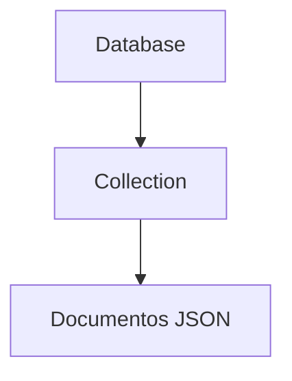

# 📦 O que é uma collection?

👉 É um conjunto de documentos JSON (na prática BSON).

No MongoDB, uma **collection** é onde os dados são armazenados — ela é o equivalente mais próximo de uma “tabela” no mundo SQL, mas com uma diferença importante: não tem estrutura fixa.

Exemplo:

```text
usuarios (collection)
```

Dentro dela:

```json
{ "nome": "Carlos", "idade": 30 }
{ "nome": "Ana", "email": "ana@email.com" }
```

---

# 🧠 Comparação com SQL

| SQL (PostgreSQL) | MongoDB    |
| ---------------- | ---------- |
| Tabela           | Collection |
| Linha            | Document   |
| Coluna           | Campo      |

---

# 📊 Exemplo real

## Collection: usuarios

```json
{
  "nome": "horadoqa",
  "idade": 30
}
```

```json
{
  "nome": "Carlos",
  "email": "carlos@email.com"
}
```

👉 Cada documento pode ter campos diferentes.

---

# ⚙️ Características importantes

* não precisa definir colunas antes
* estrutura flexível
* pode crescer dinamicamente
* armazena documentos JSON

---

# 🔄 Fluxo visual



---

# 📌 Exemplo no MongoDB

```javascript
db.usuarios.insertOne({
  nome: "Carlos",
  idade: 30
})
```

👉 Se a collection não existir, ela é criada automaticamente.

---

# 🧠 Resumo simples

* Collection = “grupo de dados”
* Dentro dela ficam os documentos
* Não tem estrutura fixa como tabelas SQL

---

