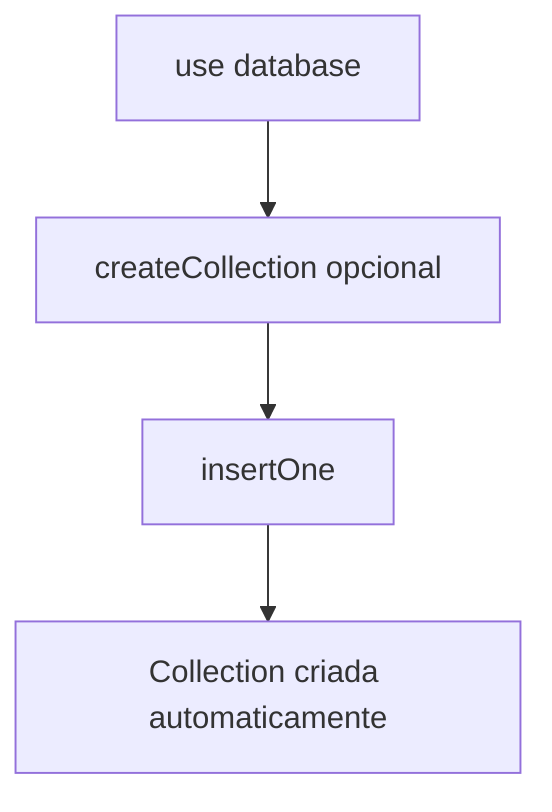

# Criando uma collection

No MongoDB, você pode criar uma **collection** de duas formas: automática ou manual.

---

# 📦 1. Criar collection automaticamente (mais comum)

Você não precisa criar antes.

Ela é criada quando você insere o primeiro documento:

```javascript
use minha_loja

db.usuarios.insertOne({
  nome: "horadoqa",
  idade: 30
})
```

👉 Isso já cria a collection `usuarios` automaticamente.

---

# 🧱 2. Criar collection manualmente

Você pode criar explicitamente com:

```javascript
db.createCollection("usuarios")
```

---

# ⚙️ 3. Criar collection com opções

Exemplo com limite de tamanho (capped collection):

```javascript
db.createCollection("logs", {
  capped: true,
  size: 5242880,
  max: 5000
})
```

---

# 📊 Comparação com SQL

| PostgreSQL              | MongoDB                     |
| ----------------------- | --------------------------- |
| CREATE TABLE            | createCollection (opcional) |
| Estrutura fixa          | Estrutura flexível          |
| Precisa definir colunas | Não precisa                 |

---

# 🔄 Fluxo visual

````markdown

````

---

# 🧠 Resumo

* ✔️ MongoDB cria collection automaticamente ao inserir dados
* ✔️ Você pode criar manualmente com `createCollection()`
* ✔️ Normalmente não precisa criar antes

---

