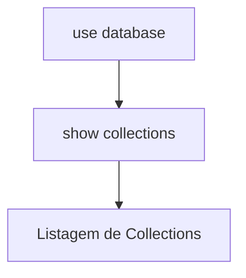

# Listar Collections

Para listar **collections** no MongoDB, você usa um comando simples no `mongosh`.

---

# 📦 Listar collections

## 1. Dentro do banco de dados

Primeiro selecione o banco:

```javascript
use minha_loja
```

---

## 2. Listar collections

```javascript
show collections
```

---

# 🧠 Outra forma (mais técnica)

```javascript
db.getCollectionNames()
```

---

# 📊 Exemplo de resultado

```text
usuarios
produtos
pedidos
```

---

# 🔄 Fluxo visual



---

# ⚙️ Resumo rápido

* `show collections` → mais simples
* `db.getCollectionNames()` → versão programática

---
