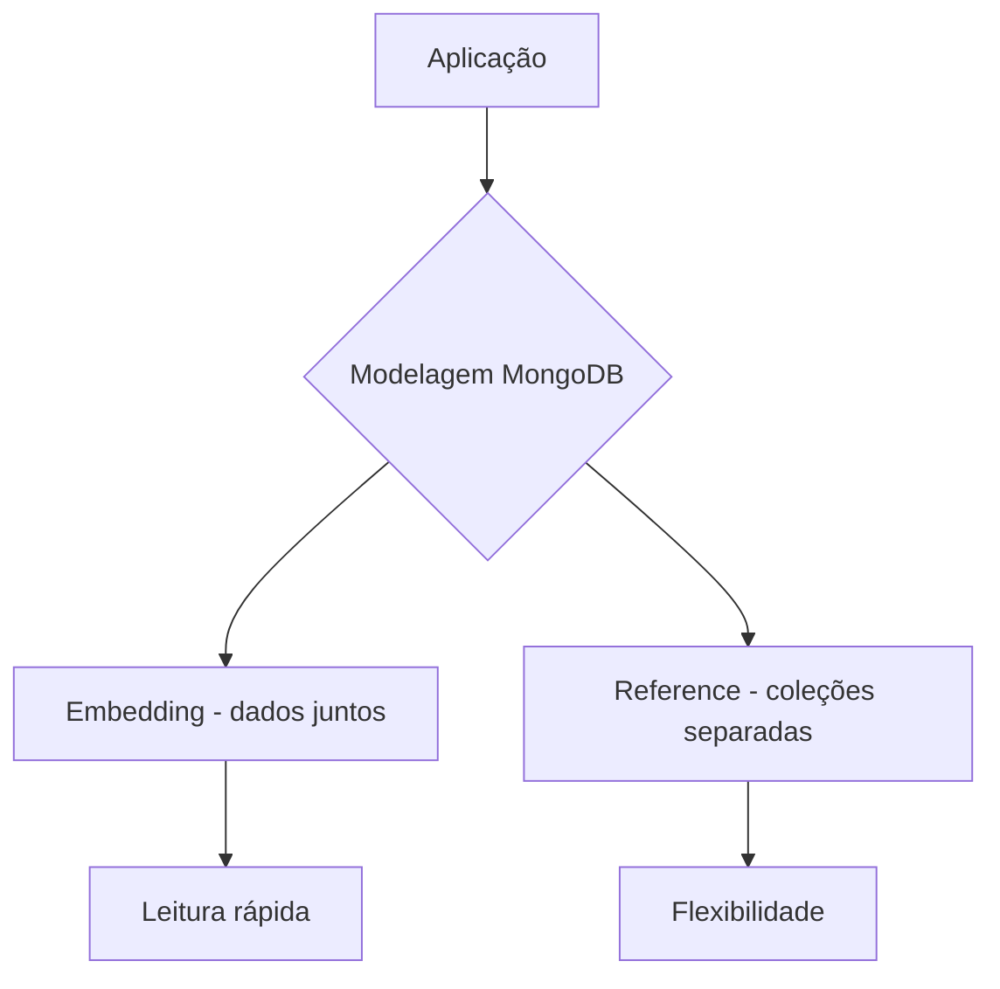

# Modelagem de Banco

---

## 🧠 Regra principal do MongoDB

👉 “Modele pelo acesso aos dados, não pelo diagrama.”

---

## 📦 1. Duas formas de modelar

### 🔹 Embedding (inserir dentro do documento)

Você coloca dados relacionados dentro do mesmo documento.

### Exemplo:

```json
{
  "nome": "Carlos",
  "email": "carlos@email.com",
  "endereco": {
    "rua": "Rua A",
    "cidade": "Rio de Janeiro"
  }
}
```

### ✔️ Use quando:

* os dados são pequenos
* são usados juntos sempre
* não precisam ser compartilhados

---

## 🔹 Referência (ligar collections)

Você separa em collections diferentes e usa IDs.

### Exemplo:

**usuarios**

```json
{
  "_id": 1,
  "nome": "Carlos"
}
```

**pedidos**

```json
{
  "usuario_id": 1,
  "produto": "Notebook"
}
```

### ✔️ Use quando:

* dados crescem muito
* precisam ser reutilizados
* relação N:N ou 1:N grande

---

# ⚖️ Comparação rápida

| Embedding      | Referência         |
| -------------- | ------------------ |
| tudo junto     | separado           |
| rápido leitura | mais flexível      |
| menos queries  | mais joins manuais |

---

# 🧱 2. Exemplo de modelagem correta (e-commerce)

## 👤 usuarios

```json
{
  "_id": 1,
  "nome": "Carlos",
  "email": "carlos@email.com"
}
```

---

## 🛒 pedidos

```json
{
  "_id": 100,
  "usuario_id": 1,
  "itens": [
    { "produto": "Mouse", "preco": 50 },
    { "produto": "Teclado", "preco": 100 }
  ],
  "total": 150
}
```

👉 Aqui usamos:

* referência para usuário
* embedding para itens do pedido

---

# 📊 3. Regra de ouro

👉 “Dados que mudam juntos, ficam juntos.”

---

# 🔥 4. Quando ERRAR o modelagem

❌ Criar “tabelas SQL no MongoDB”

Exemplo ruim:

```json
usuario_id: 1
endereco_id: 10
telefone_id: 20
```

👉 Isso gera muitas queries e perde performance.

---

# 🚀 5. Quando usar cada um

## Use EMBED quando:

* leitura é mais importante que escrita
* dados são pequenos
* relação é 1:1 ou 1:few

## Use REFERENCE quando:

* dados crescem muito
* precisa reutilizar
* relação é N:N
* atualização independente

---

# 🔄 Fluxo visual



---

# 🧠 Resumo simples

* MongoDB ≠ SQL
* Não pense em tabelas
* Pense em uso dos dados
* Embedding = junto
* Reference = separado

---

