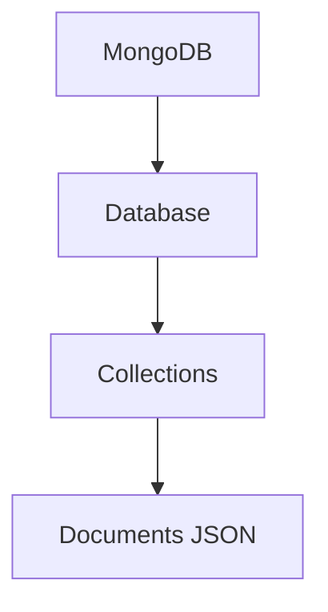

# 🐳 Criando um Banco MongoDB com Docker usando Docker Compose

Este formato é o mais organizado. Todas as instruções ficam em um só arquivo, ao invés de executar comandos separados.

Crie um arquivo chamado `docker-compose.yml`:

```yaml
services:
  mongodb:
    image: mongo:8
    container_name: mongodb
    restart: always

    environment:
      MONGO_INITDB_ROOT_USERNAME: horadoqa
      MONGO_INITDB_ROOT_PASSWORD: 1q2w3e4r

    ports:
      - "27017:27017"

    volumes:
      - mongodb_data:/data/db

volumes:
  mongodb_data:
```

---

# ▶️ Como subir tudo

No terminal, na pasta do arquivo:

```bash
docker compose up -d
```

---

# 🛑 Como parar

```bash
docker compose down
```

---

# 📜 Ver logs

```bash
docker compose logs -f
```

---

# ⚠️ Resetar tudo

Remove containers + volume do banco:

```bash
docker compose down -v
```

---

# 🗂️ Estrutura do MongoDB




---

# 📦 Interface gráfica recomendada

Você pode usar:

* MongoDB Compass
* DBeaver

---

# 🔗 Download oficial

* [MongoDB Official Website](https://www.mongodb.com/?utm_source=chatgpt.com)
* [MongoDB Compass](https://www.mongodb.com/products/tools/compass?utm_source=chatgpt.com)
* [Docker Official Website](https://www.docker.com/?utm_source=chatgpt.com)

---

# 🚀 Versão usada

```yaml
image: mongo:8
```

Atualmente é a linha mais recente estável do MongoDB.
