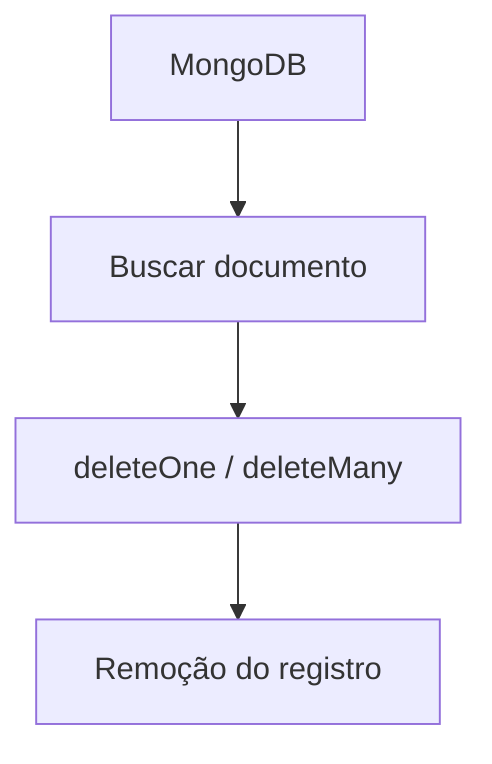

# Apagando um registro no MongoDB

Para apagar um registro no MongoDB, você usa principalmente `deleteOne()` ou `deleteMany()`.

---

# 🗑️ DELETE no MongoDB

## 🧠 Estrutura básica

```javascript
db.collection.deleteOne({ filtro })
```

---

# ❌ 1. Apagar um único registro

Exemplo: remover um usuário pelo nome

```javascript
db.usuarios.deleteOne({ nome: "horadoqa" })
```

---

# ❌ 2. Apagar vários registros

Exemplo: remover todos com idade 30

```javascript
db.usuarios.deleteMany({ idade: 30 })
```

---

# ⚠️ 3. Apagar tudo da coleção

```javascript
db.usuarios.deleteMany({})
```

👉 Isso remove TODOS os documentos da collection.

---

# 🧾 Resultado esperado

```json
{
  "acknowledged": true,
  "deletedCount": 1
}
```

---

# 🔄 Fluxo visual



---

# ⚙️ Diferença importante

| Método     | O que faz         |
| ---------- | ----------------- |
| deleteOne  | apaga 1 documento |
| deleteMany | apaga vários      |
| {} vazio   | apaga tudo        |

---

# 📌 Exemplo completo

Antes:

```json
{
  "nome": "horadoqa",
  "idade": 30
}
```

Depois:

```text
Documento removido
```

---

# 🚨 CUIDADO

```javascript
db.usuarios.deleteMany({})
```

Isso é equivalente a:

> apagar toda a tabela

---
