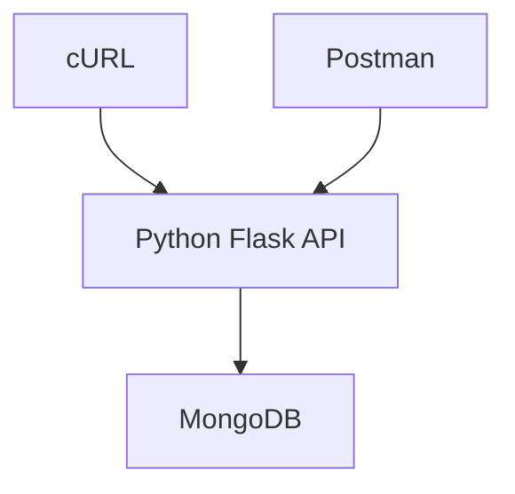

# Inserindo dados no banco com MongoDB

Exemplos de inserção de dados no MongoDB usando **Python**, **cURL** e **Postman (collection pronta)**.

Assumindo que o MongoDB está rodando localmente via Docker:

```text
mongodb://localhost:27017
```

---

# 🐍 1. Inserir dados com Python

Usando o driver oficial PyMongo

## Instalar:

```bash
pip install pymongo
```

---

## Código:

```python id="py1"
from pymongo import MongoClient

# Conexão com MongoDB
client = MongoClient("mongodb://localhost:27017")

# Banco de dados
db = client["horadoqa"]

# Collection
collection = db["usuarios"]

# Documento
usuario = {
    "nome": "horadoqa",
    "idade": 30,
    "email": "horadoqa@gmail.com"
}

# Inserir dados
result = collection.insert_one(usuario)

print("ID inserido:", result.inserted_id)
```

---

# 🌐 2. Inserir dados com cURL (via API)

⚠️ Importante: MongoDB NÃO aceita HTTP direto.
Então você precisa de uma API intermediária (ex: Node.js ou Python Flask).

Vou te dar um exemplo com API simples usando Flask.

---

## API Python (Flask + MongoDB)

```bash
pip install flask pymongo
```

```python id="api1"
from flask import Flask, request, jsonify
from pymongo import MongoClient

app = Flask(__name__)
client = MongoClient("mongodb://localhost:27017")

db = client["horadoqa"]
collection = db["usuarios"]

@app.route("/usuarios", methods=["POST"])
def criar_usuario():
    data = request.json
    result = collection.insert_one(data)
    return jsonify({"id": str(result.inserted_id)})

if __name__ == "__main__":
    app.run(debug=True)
```

---

## Rodar API:

```bash
python app.py
```

---

## Agora usar cURL:

```bash id="curl1"
curl -X POST http://127.0.0.1:5000/usuarios \
-H "Content-Type: application/json" \
-d '{
  "nome": "horadoqa",
  "idade": 30,
  "email": "horadoqa@gmail.com"
}'
```

---

# 📬 3. Postman (Collection pronta)

## Endpoint

```
POST http://127.0.0.1:5000/usuarios
```

---

## Body (JSON)

```json
{
  "nome": "horadoqa",
  "idade": 30,
  "email": "horadoqa@gmail.com"
}
```

---

## Headers

| Key          | Value            |
| ------------ | ---------------- |
| Content-Type | application/json |

---

## 📦 Collection do Postman (importável)

Você pode salvar isso como `mongo-api.postman_collection.json`:

```json
{
  "info": {
    "name": "MongoDB API",
    "_postman_id": "12345",
    "schema": "https://schema.getpostman.com/json/collection/v2.1.0/collection.json"
  },
  "item": [
    {
      "name": "Create User",
      "request": {
        "method": "POST",
        "header": [
          {
            "key": "Content-Type",
            "value": "application/json"
          }
        ],
        "body": {
          "mode": "raw",
          "raw": "{\n  \"nome\": \"horadoqa\",\n  \"idade\": 30,\n  \"email\": \"horadoqa@gmail.com\"\n}"
        },
        "url": {
          "raw": "http://127.0.0.1:5000/usuarios",
          "protocol": "http",
          "host": ["127", "0", "0", "1"],
          "port": "5000",
          "path": ["usuarios"]
        }
      }
    }
  ]
}
```

---

# 🔄 Fluxo completo



---

# 🧠 Resumo

* Python → conecta direto no MongoDB (PyMongo)
* cURL → precisa de API intermediária
* Postman → testa a API visualmente

---

