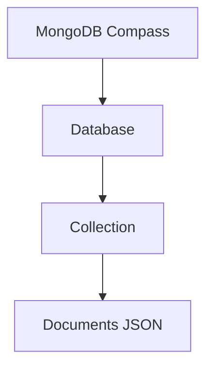

MongoDB Compass é um programa oficial do MongoDB que permite você visualizar e gerenciar bancos de dados de forma visual, sem precisar ficar usando só comandos no terminal.

---

# 🧭 O que ele faz

Com o MongoDB Compass você consegue:

* Ver bancos de dados
* Criar collections (tipo “tabelas”)
* Inserir documentos JSON
* Editar dados diretamente na tela
* Rodar consultas (queries)
* Analisar estrutura dos dados
* Explorar índices e performance

---

# 🧠 Em palavras simples

É como um “explorador visual” do MongoDB.

Em vez de digitar:

```javascript
db.usuarios.find()
```

Você pode:

* clicar
* filtrar
* visualizar dados em tabela

---

# 📊 Exemplo de visualização

````markdown

````

---

# 🔥 Diferença para ferramentas SQL

| Ferramenta      | Tipo de banco          |
| --------------- | ---------------------- |
| DBeaver         | SQL + múltiplos bancos |
| MongoDB Compass | Apenas MongoDB         |

---

# ⚙️ O que ele substitui

Ele substitui a necessidade de usar só o terminal:

```bash
mongosh
```

Mas o terminal ainda pode ser usado junto.

---

# 📦 Exemplo real

Você pode ver isso no Compass:

```json
{
  "nome": "Carlos",
  "idade": 30,
  "email": "carlos@email.com"
}
```

---

# 🚀 Quando usar

Use o MongoDB Compass quando quiser:

* aprender MongoDB visualmente
* debugar dados
* entender estrutura de documentos
* trabalhar mais rápido sem terminal

---

# 🔗 Download oficial

[MongoDB Compass](https://www.mongodb.com/products/tools/compass?utm_source=chatgpt.com)

---
