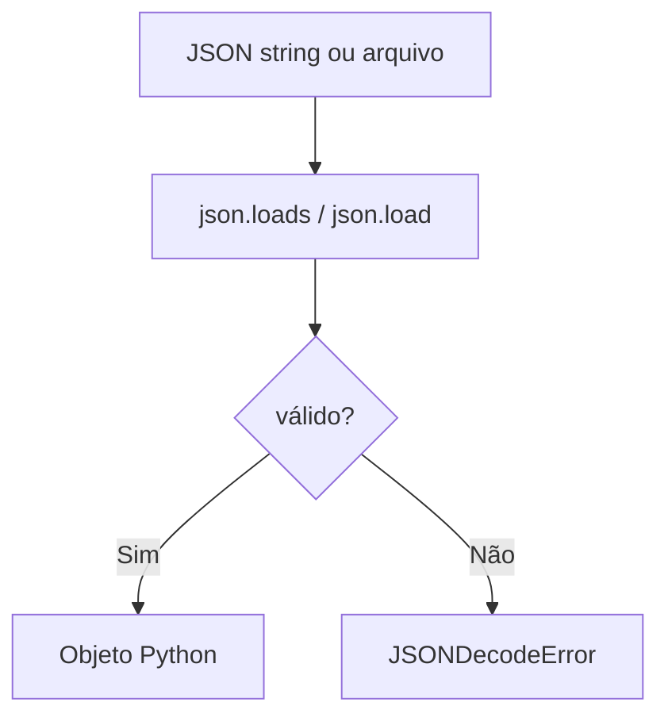

# 🧠 Validar JSON no Python

## ✔️ 1. Validar string JSON

```python
import json

dados = '{"nome": "Carlos", "idade": 30}'

try:
    json.loads(dados)
    print("JSON válido ✔️")
except json.JSONDecodeError as e:
    print("JSON inválido ❌")
    print(e)
```

---

# 📦 O que acontece aqui

* `json.loads()` → tenta converter string em JSON
* se der erro → JSON inválido
* se funcionar → JSON válido

---

# ❌ Exemplo inválido

```python
import json

dados = '{nome: "Carlos", idade: 30}'

json.loads(dados)
```

👉 Isso gera erro porque:

* falta aspas nas chaves (`"nome"`)
* JSON precisa ser padrão estrito

---

# ✔️ 2. Validar arquivo JSON

```python
import json

with open("dados.json", "r", encoding="utf-8") as f:
    try:
        json.load(f)
        print("JSON válido ✔️")
    except json.JSONDecodeError as e:
        print("JSON inválido ❌")
        print(e)
```

---

# 🔄 3. Validar + mostrar dados

```python
import json

dados = '{"nome": "Ana", "idade": 25}'

obj = json.loads(dados)

print(obj["nome"])
```

---

# 📊 Fluxo visual



---

# 🧠 Resumo simples

* `json.loads()` → valida string JSON
* `json.load()` → valida arquivo JSON
* erro comum → `JSONDecodeError`

---

# 🚀 Dica importante

Python exige JSON **100% correto**, então:

* aspas duplas `" "` obrigatórias
* vírgulas corretas
* nada de variáveis sem aspas

---

