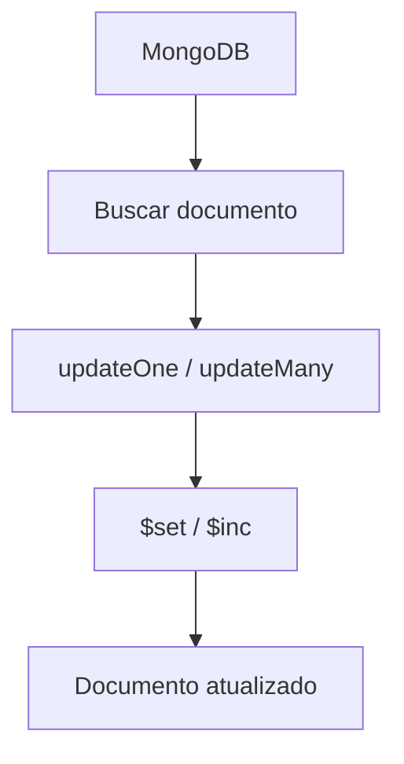

# Atualizando Dados no MongoDB

Para atualizar dados no MongoDB, você usa principalmente os métodos `updateOne()` ou `updateMany()`.

---

# 🔄 UPDATE no MongoDB

## 🧠 Estrutura básica

```javascript
db.collection.updateOne(
   { filtro },
   { $set: { campo: novoValor } }
)
```

---

# ✏️ 1. Atualizar um único documento

Exemplo: atualizar o email de um usuário

```javascript
db.usuarios.updateOne(
  { nome: "horadoqa" },
  {
    $set: {
      email: "novoemail@gmail.com"
    }
  }
)
```

---

# ✏️ 2. Atualizar mais de um campo

```javascript
db.usuarios.updateOne(
  { nome: "horadoqa" },
  {
    $set: {
      idade: 31,
      email: "novoemail@gmail.com"
    }
  }
)
```

---

# 🔁 3. Atualizar vários documentos

```javascript
db.usuarios.updateMany(
  { idade: 30 },
  {
    $set: {
      ativo: true
    }
  }
)
```

---

# 📌 4. Incrementar valores

Exemplo: aumentar idade em +1

```javascript
db.usuarios.updateOne(
  { nome: "horadoqa" },
  {
    $inc: {
      idade: 1
    }
  }
)
```

---

# 🧾 Resultado esperado

```json
{
  "acknowledged": true,
  "modifiedCount": 1
}
```

---

# 🔄 Fluxo visual



---

# ⚠️ Importante

* `$set` → altera valores
* `$inc` → incrementa números
* Se o filtro não bater, nada é atualizado
* `updateOne()` altera só 1 documento
* `updateMany()` altera vários

---

# 📊 Exemplo completo

Antes:

```json
{ "nome": "horadoqa", "idade": 30 }
```

Depois:

```json
{ "nome": "horadoqa", "idade": 31 }
```

---
