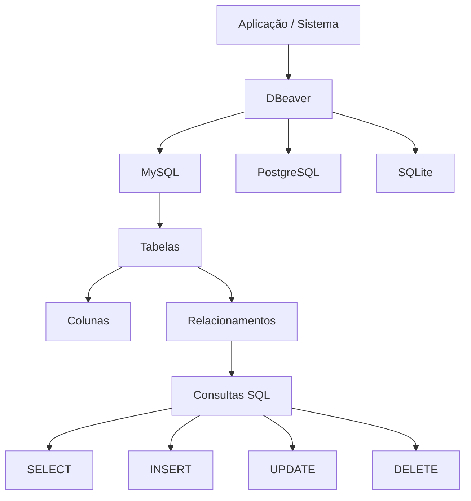
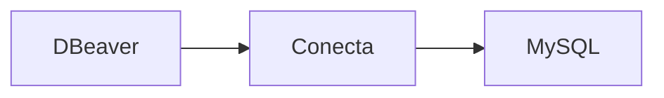

# DBeaver

O DBeaver é um programa usado para administrar bancos de dados SQL de forma visual.
Ele funciona como uma interface gráfica para você criar, editar e consultar bancos sem precisar fazer tudo apenas por comandos.

## O que o DBeaver faz

Com ele você pode:

* Criar bancos de dados
* Criar tabelas
* Executar comandos SQL
* Visualizar dados
* Fazer backup
* Importar/exportar dados
* Conectar vários tipos de banco

---

## Bancos que ele suporta

O DBeaver conecta com:

* MySQL
* PostgreSQL
* SQLite
* MariaDB
* Oracle Database
* Microsoft SQL Server

Exemplo:

---

## Como ele funciona

Você instala o DBeaver no computador e conecta no banco.

Exemplo:

Depois você consegue:

* clicar nas tabelas
* editar dados visualmente
* rodar SQL
* ver diagramas

---

## Exemplo prático

Você cria uma conexão com MySQL:

1. Host: localhost
2. Porta: 3306
3. Usuário: root
4. Senha: sua senha

Depois o DBeaver abre tudo visualmente.

---

## Vantagens

### Fácil para iniciantes

Você não precisa decorar muitos comandos.

### Interface gráfica

Tudo aparece em árvore/pastas.

### Multibanco

Um único programa para vários bancos.

### Gratuito

Existe versão Community grátis.

---

## Download oficial

[DBeaver Official Website](https://dbeaver.io/?utm_source=chatgpt.com)

---

## Comparação rápida

| Ferramenta      | Banco principal |
| --------------- | --------------- |
| DBeaver         | Vários bancos   |
| MySQL Workbench | MySQL           |
| pgAdmin         | PostgreSQL      |

---

## Para quem vale a pena

Muito bom para:

* estudantes
* programadores
* analistas
* administradores de banco

Especialmente se você trabalha com mais de um tipo de banco SQL.

---

## Exemplo visual do fluxo

---

