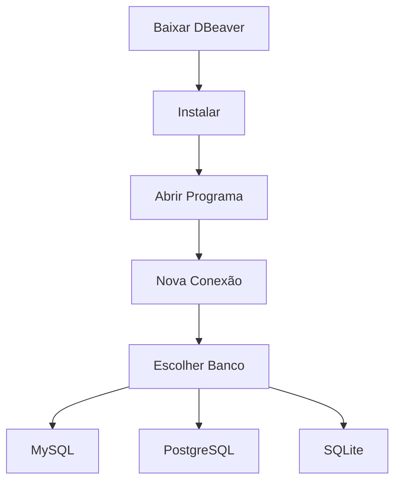

# Instalar o DBeaver

## Download oficial

[DBeaver Official Website](https://dbeaver.io/download/?utm_source=chatgpt.com)

---

## Windows

1. Entre no site
2. Baixe:

   * **DBeaver Community**
3. Execute o instalador `.exe`
4. Clique em:

   * Next
   * Accept
   * Install
5. Finalize em **Finish**

Depois o DBeaver já abre.

---

## Linux (Ubuntu/Debian)

Instalação via terminal:

```bash
sudo apt update
sudo snap install dbeaver-ce
```

Ou baixar `.deb` no site oficial.

---

## macOS

Opções:

### Via Homebrew

```bash id="e4u7m6"
brew install --cask dbeaver-community
```

### Manual

Baixe `.dmg` no site oficial e arraste para Applications.

---

# Primeiro acesso

Quando abrir:

1. Clique em:

   * **New Database Connection**
2. Escolha o banco:

   * MySQL
   * PostgreSQL
   * SQLite
3. Preencha:

   * Host
   * Porta
   * Usuário
   * Senha

Exemplo MySQL:

| Campo   | Valor     |
| ------- | --------- |
| Host    | localhost |
| Porta   | 3306      |
| Usuário | root      |

---

# Exemplo em Mermaid

````markdown

````

---

# Drivers

Na primeira conexão o DBeaver pode pedir:

> Download Driver

Clique em:

* Download
* OK

Ele baixa automaticamente o driver JDBC.

---

# Versões

| Versão     | Tipo     |
| ---------- | -------- |
| Community  | Gratuita |
| Enterprise | Paga     |

A Community já atende quase tudo para estudo e desenvolvimento.

---

# Recursos úteis

Você consegue:

* executar SQL
* criar tabelas
* importar CSV
* gerar ERD
* fazer backup
* editar dados visualmente

---

## Documentação oficial

[DBeaver Docs](https://dbeaver.com/docs/dbeaver/?utm_source=chatgpt.com)
