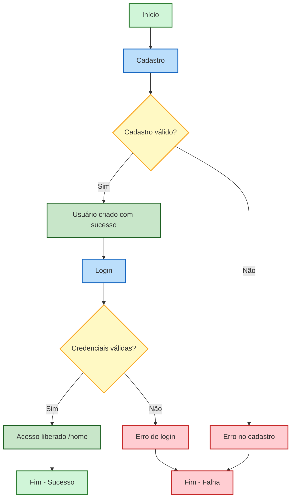

# 🎨 Diagrama — Cadastro e Login

---

## 🧠 O que as cores significam

* 🟢 Verde → sucesso
* 🔵 Azul → processos (Cadastro / Login)
* 🟡 Amarelo → decisões (validação)
* 🔴 Vermelho → erros/falhas
* 🟩 Verde claro → início e fim

---

