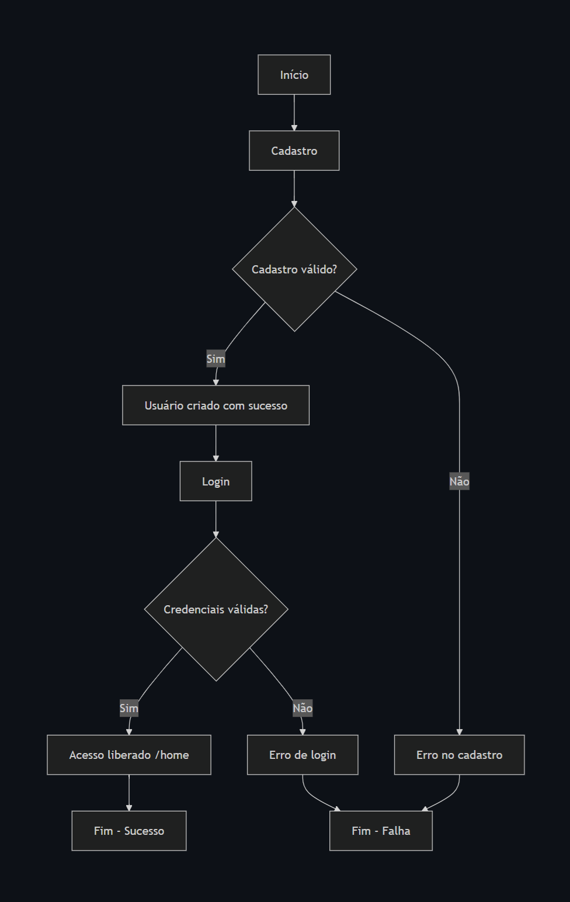

# 🧭 Diagrama — Cadastro e Login

## 📌 Fluxo representado

* 🟢 Cadastro válido → usuário criado → login → acesso liberado
* 🔴 Cadastro inválido → fluxo interrompido
* 🔐 Login inválido → acesso negado
* 🎯 Login válido → usuário autenticado com sucesso